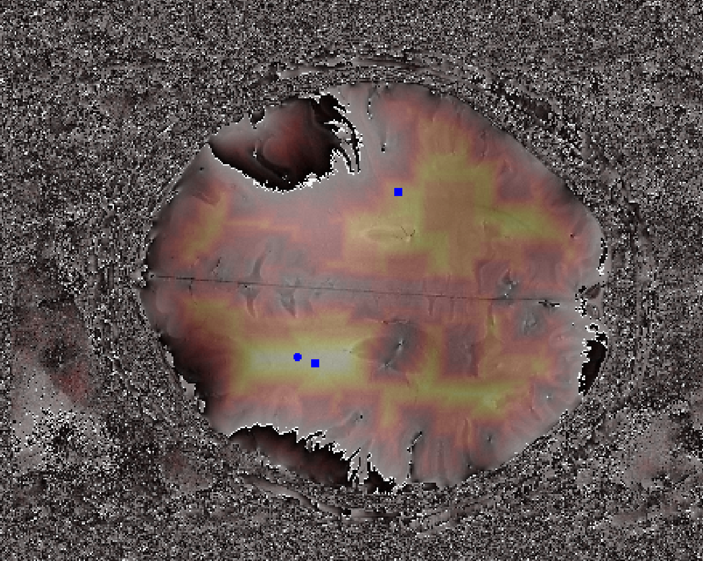

# Phase Unwrapping Seed Selection

This project aims to identify good seed points for Phase Unwrapping.

## Project Overview

Phase unwrapping is the process of removing the 2π modulus ambiguity from a wrapped phase image to recover the absolute
phase.
This is an essential step in imaging applications based on wave phenomena, specifically Magnetic Resonance Imaging (MRI)
of the brain.

Seed selection plays a pivotal role in phase unwrapping algorithms, in particular for images of the brain.
The seeds, which serve as starting points for the unwrapping process, should be located within the brain areas and
should not be located on phase wraps.
The quality of these seeds can substantially dictate the precision of the unwrapped phase image.

Below, you see a screenshot that outlines how the algorithm works.



1. Identify voxels that are likely to be near a phase wrap. This is done using a simple correlation filter that identifies
   edges in the image. We get an absolute magnitude image of how strong the edge is. 
2. Calculate the 0.9-quantile of all edge voxels and threshold the image using this value.
3. Thresholding will certainly dismiss some phase wraps. However, the goal of the last step is to get a mask image that
   is an indicator where lots of phase wraps are.
4. (Optionally) we exclude regions that are masked out by the image recon
5. Calculate the distance transform of this image that for each voxel has the minimal distance to the next phase wrap.
6. Select areas (or seed points) from regions that have the highest distance to the next phase wrap.

The actual implementation is much simpler than the above description.
Please check `phase_jumps_by_correlation` and `seed_points_by_distance_transform` in `findSeedPoints.py` to see how
it works.

## Usage

For starters, you need a phase image of a brain scan. Then

```
python findSeedPoints.py --help
```

## Installation

1. If Miniforge has not been installed, download and install it:
   - You can download it from the official GitHub page: https://github.com/conda-forge/miniforge#download
2. Once Miniforge is installed, create a new environment from the 'environment.yml' file with this command:
   ```
   conda env create -f environment.yml
   ```
3. After your environment is successfully created, you can activate it with: `conda activate UnwrapSeedPoints`
4. Now, all dependencies contained in the 'environment.yml' file will be installed in this environment,
   and choosing this environment will allow you to run the scripts.
